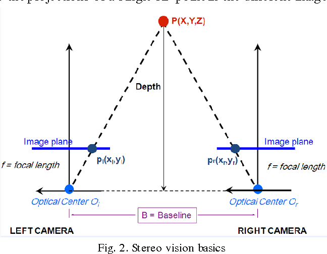
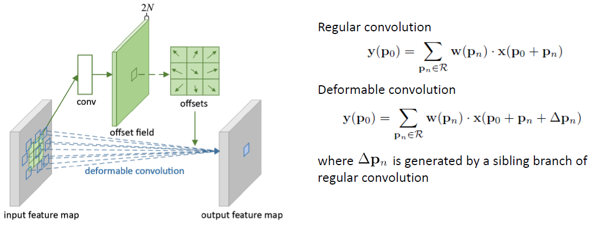

# CPSC482-AANet

# Adaptive Stereo Matching

## Introducing the Problem

Stereo matching is a crucial task in computer vision that aims to reconstruct a depth map of the scene using the downstream task of triangulation. More than one image is needed to estimate the distance to objects in an image, as any point in a 3D scene, no matter its location along the projective line, will get mapped to the exact pixel location. Therefore, at least two images of the same scene from different viewpoints are necessary. Among several stereo camera system representations available, the parallel system, which represents two frames with parallel optical axes, provides the most straightforward means for depth estimation. 

    

First, two cameras with known intrinsic properties, such as focal length and image sensor size, are calibrated to estimate the camera matrix responsible for projecting 3D points onto the 2D plane. The two calibrated cameras' fields of view are assumed to be separated by some baseline distance, which constrains the possible locations of the 3D point as captured by two frames. In stereo vision, the objects in the scene are assumed to change in-between frames by unknown translation but no rotation. The same point in such a 3D scene will be captured by two cameras, where the corresponding pixel will appear at different spatial locations in these two frames. The horizontal difference in pixel location corresponding to the same point in space is called ‘‘disparity.’’ Using epipolar geometry, the triangulation equation states that the depth of the point is equal to the product of the focal length and baseline distance, divided by the disparity between the 2D image coordinates of the point in the left and right images.

$$Z = \frac{f \cdot T}{d}$$
Z - depth of the point\
f- focal length of a camera\
d -a disparity between the 2D images coordinates of the point in the left and right images
 
 The disparity is the single ambiguous factor and, rightfully, gave rise to one of the most heavily investigated topics in computer vision - stereo correspondence.

## Introducing the Problem

## Stereo Correspondence Framework and Main Challenges
All stereo-matching algorithms in some shape or form follow the following sequence of the “building blocks”: 

* matching cost computation
* cost aggregation (local or global)
* disparity computation
* disparity refinement.

In the matching cost computations step, a cost function measures the similarity between pixels in the left and right images. As the cost function can be based on various image features, so one of the main challenges is designing a reliable cost function in ambiguous regions that lack distinctive features. The areas that tend to produce the most unreliable estimates are: 
1. Textureless regions
2. Occluded regions
3. Depth discontinuity regions 

For example, occluded regions where one image or both images in the stereo pair are blocked by foreground objects often contain repeating patterns or structures that are difficult to match correctly, leading to erroneous disparities. Similarly, textureless regions lack distinctive features that can be used to match corresponding pixels, leading to low or even zero matching costs. Disparity discontinuities, on the other hand, pose a difficulty for the cost aggregation step, as the cost aggregations step tends to average matching costs over a small window around each pixel. Such basic smoothing operation causes disparity to be underestimated or overestimated in regions with ambiguous matching costs. All the aforementioned regions prevent the traditional stereo-correspondence algorithm from arriving at the most accurate depth estimation by flattening the edges at disparity discontinuities. 

## Towards Content-Adaptive Feature Extraction: Deformable Convolutions 

Convolutional neural networks have become the dominant approach for various computer vision tasks. However, traditional convolutional layers have an inherent drawback - their spatial sharing nature.  Regular convolutions apply the same filter weights to all spatial locations of the input feature map, making them content-agnostic, meaning the same features are extracted from all spatial locations. While being beneficial for many tasks, stereo-matching necessitates maintaining the spatial relationships between objects by only relevant features of distinct objects. 

    

To address this limitation, deformable convolutions were proposed to introduce spatial variation in filter weights. To account for the geometric variations of the input (scale, pose, viewpoint, deformation), the filter weights are no longer fixed but are learned as offsets from the regular grid to match the underlying structures. 

To illustrate, here is the response of the **regular convolution** for the feature map $y$ for some neighborhood $p$:
$$y(p_0) = \sum_{p_n \in R} w(p_n) \cdot x(p_0 + p_n)$$ 
where set $R$ describes the dilation ${(-1,-1),(-1,0),\dots,(0,1),(1,1)}$

The deformable convolution introduces offsets to the regular grid as:

$$y(p_0) = \sum_{p_n \in R} w(p_n) \cdot x(p_0 + p_n + \Delta p_n)$$

where the offset $\Delta p_n$ is typically fractional and implemented using bilinear interpolation.

The additional convolutional layers called "offset layer" take the feature map as input and outpu offset values for each spatial location, represented as 2D vector for horizontal and verical displacement. The offset layers are trained jointly with the rest of the network and offsets are updated through the same process of back propagation. 

## Local Cost Aggregation 

One of the key challenge in finding stereo correspondences between individual pixels is handling noise. One approach to overcome this challenge is to aggregate local losses over some neighborhood. The general form of local cost aggregation $\tilde{C}(d,p)$ at pixel $p$ for disparity candidate $d$ over some neighborhood $N(p)$ is the following:

$$\tilde{C}(d,p) = \sum_{q \in N(p)} w(p,q)C(d,q)$$

where $w(p,q)$ is the aggregation weight for some neighbor $q$

While proven succesful in many application, local methods for cost aggregation have serious limitations in underlying assumtions. Aggregating over some region assumes neighbors have negligible discrepancies in disparities, which obviously does't hold for object boundaries - disparity discontinuities. Even though the weight are data-dependent, the standard convolutions act as the bottleneck since they are content-agnostic. Increasing search window size would  help improve the matching accuracy, but at a too high of a computational cost. 

On the way towards the robustness against disparity discontinuities, a method needs not only content-adaptive weighting but also a sparse point matching to bring down the computational complexity for real-time disparity estimation. 

