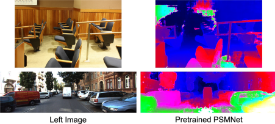
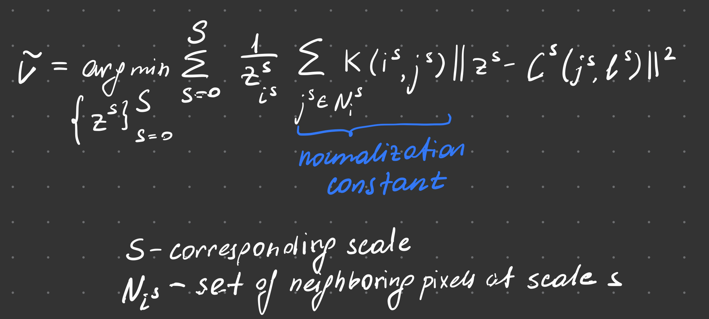
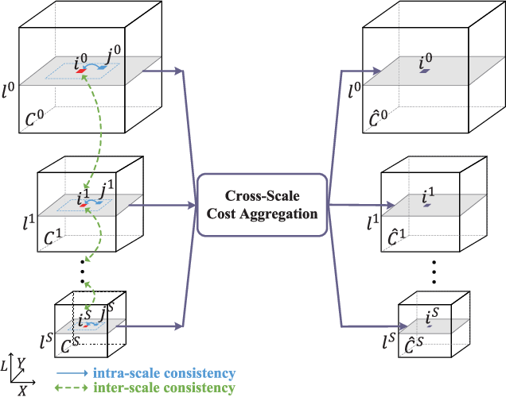
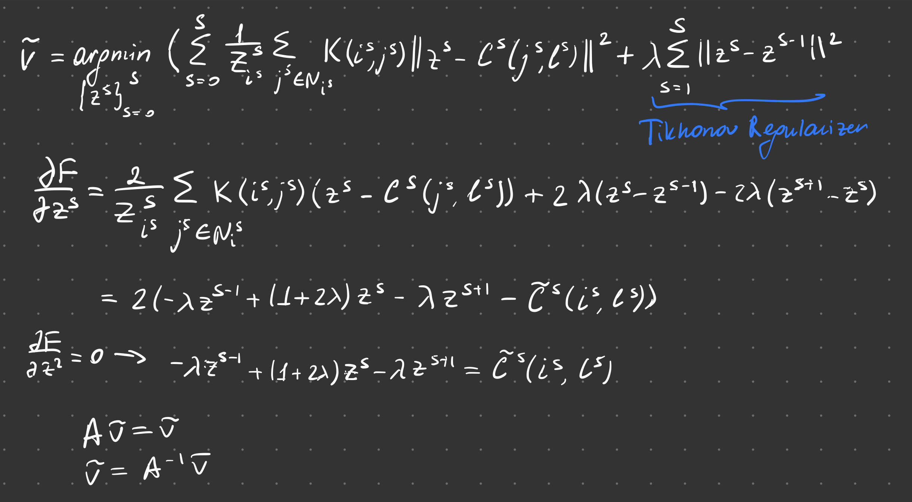
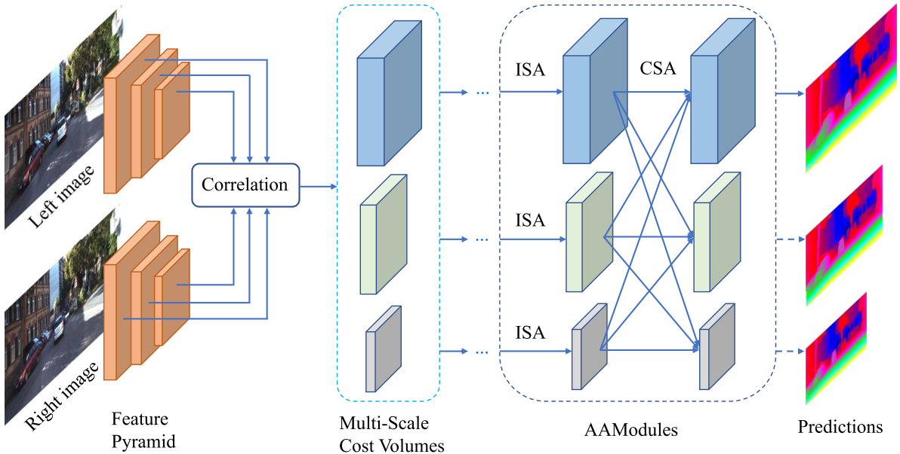
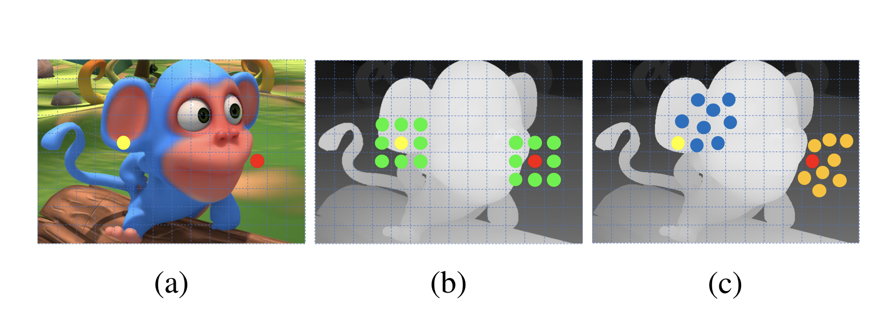
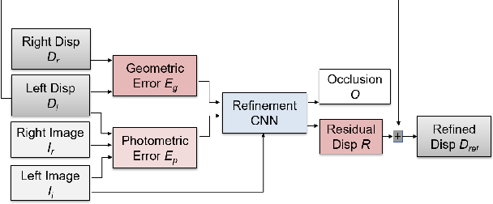
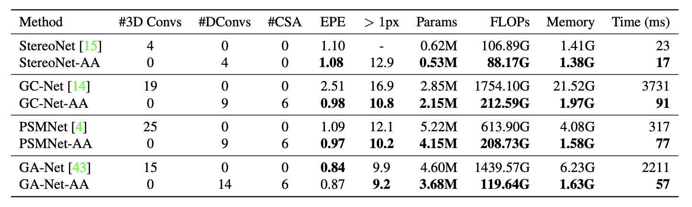
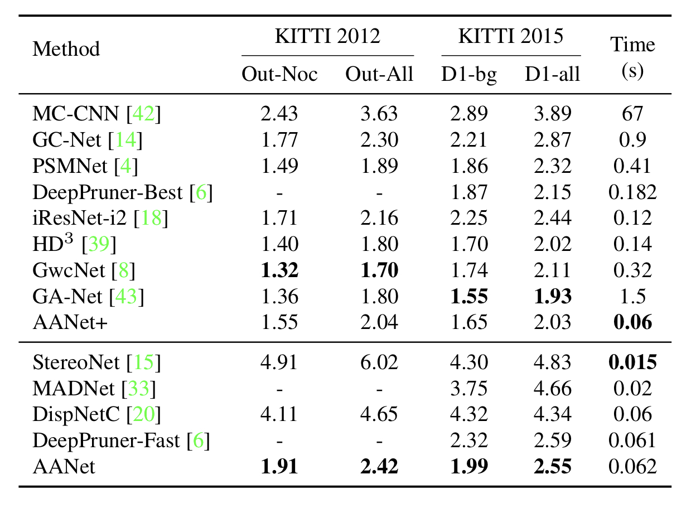

# CPSC482-AANet

# Adaptive Stereo Matching

## Introducing the Problem

Stereo matching is a crucial task in computer vision that aims to reconstruct a depth map of the scene using the downstream task of triangulation. More than one image is needed to estimate the distance to objects in an image, as any point in a 3D scene, no matter its location along the projective line, will get mapped to the exact pixel location. Therefore, at least two images of the same scene from different viewpoints are necessary. Among several stereo camera system representations available, the parallel system, which represents two frames with parallel optical axes, provides the most straightforward means for depth estimation. 

    

First, two cameras with known intrinsic properties, such as focal length and image sensor size, are calibrated to estimate the camera matrix responsible for projecting 3D points onto the 2D plane. The two calibrated cameras' fields of view are assumed to be separated by some baseline distance, which constrains the possible locations of the 3D point as captured by two frames. In stereo vision, the objects in the scene are assumed to change in-between frames by unknown translation but no rotation. The same point in such a 3D scene will be captured by two cameras, where the corresponding pixel will appear at different spatial locations in these two frames. The horizontal difference in pixel location corresponding to the same point in space is called ‘‘disparity.’’ Using epipolar geometry, the triangulation equation states that the depth of the point is equal to the product of the focal length and baseline distance, divided by the disparity between the 2D image coordinates of the point in the left and right images.

$$Z = \frac{f \cdot T}{d}$$
Z - depth of the point\
f- focal length of a camera\
d -a disparity between the 2D images coordinates of the point in the left and right images
 
 The disparity is the single ambiguous factor and, rightfully, gave rise to one of the most heavily investigated topics in computer vision - stereo correspondence.

## Stereo Correspondence Framework and Main Challenges
All stereo-matching algorithms in some shape or form follow the following sequence of the “building blocks”: 

* matching cost computation
* cost aggregation (local or global)
* disparity computation
* disparity refinement.

In the matching cost computations step, a cost function measures the similarity between pixels in the left and right images. As the cost function can be based on various image features, one of the main challenges is designing a reliable cost function in ambiguous regions lacking distinctive features. The areas that tend to produce the most unreliable estimates are: 
1. Textureless regions
2. Occluded regions
3. Depth discontinuity regions 

For example, occluded regions where one image or both images in the stereo pair are blocked by foreground objects often contain repeating patterns or structures that are difficult to match correctly, leading to erroneous disparities. Similarly, textureless regions lack distinctive features that can be used to match corresponding pixels, leading to low or even zero matching costs. Disparity discontinuities, on the other hand, pose a difficulty for the cost aggregation step, as the cost aggregations step tends to average matching costs over a small window around each pixel. Such basic smoothing operation causes disparity to be underestimated or overestimated in regions with ambiguous matching costs. All the regions mentioned above prevent the traditional stereo-correspondence algorithm from arriving at the most accurate depth estimation by flattening the edges at disparity discontinuities. 

    

### Local Cost Aggregation 

One of the key challenge in finding stereo correspondences between individual pixels is handling noise. One approach to overcome this challenge is to aggregate local losses over some neighborhood. The general form of local cost aggregation $\tilde{C}(d,p)$ at pixel $p$ for disparity candidate $d$ over some neighborhood $N(p)$ is the following:

$$\tilde{C}(d,p) = \sum_{q \in N(p)} w(p,q)C(d,q)$$

where $w(p,q)$ is the aggregation weight for some neighbor $q$

While proven successful in many applications, local methods for cost aggregation have serious limitations in underlying assumptions. Aggregating over a region assumes neighbors have negligible discrepancies in disparities, which obviously doesn't hold for object boundaries - disparity discontinuities. Even though the weights are data-dependent, the standard convolutions act as the bottleneck since they are content-agnostic. Increasing the search window size would help improve the matching accuracy but at too high of a computational cost. 

On the way toward robustness against disparity discontinuities, a method needs content-adaptive weighting and sparse point matching to bring down the computational complexity for real-time disparity estimation. 

### Cross-Scale Cost Aggregation 

In the pipeline for a stereo-matching algorithm, the quality of cost aggregation significantly impacts the resultant disparity estimate, with different variants for the aggregation proposed for state-of-the-art algorithms. The basic idea of combining matching costs across multiple scales is that different spatial scales capture different levels of detail in the scene. At a coarse level, the matching cost can capture the global structure and the overall disparity range of the scene, while at a fine scale, the matching cost can capture local details and edges. Cross-scale aggregation can be thought of as joint filtering over the cost volume.

Let's say by applying cost computation to a stereo pair $I, I_0 \in \mathbb{R}^{W\times H \times 3}$ $$C = f(I, I_0)$$ we get cost volume $C\in\mathbb{R}^{W\times H \times L}$ at all possible disparity level $L$ for each pixel. 

Then, the multi-scale version of local cost aggregation outlibned above would be: 

    

, where $K(i,j)$ is the similarity kernel and $l$ is the disparity candidate . Then,  $$\tilde{v} = [\tilde{C}^0(i^0,l^0),\tilde{C}^1(i^1,l^1),\dots,\tilde{C}^S(i^S,l^S)]$$ 

    

which is obtained by performning cost aggregation at each scale independently with local cost aggregation. Now, by introucing Tikhonov regularizer to enforce inter-scale consistency and promote smoothness in the estimated disparity by penalizing large changes in disparity values  we arrive at convex optimization problem that can be solved analitically. 

    

The final cost volume is obtained by weighted combinationcost aggregation performed at different scales. 

### Towards Content-Adaptive Feature Extraction: Deformable Convolutions 

Convolutional neural networks have become the dominant approach for various computer vision tasks. However, traditional convolutional layers have an inherent drawback - their spatial sharing nature. Regular convolutions apply the same filter weights to all spatial locations of the input feature map, making them content-agnostic, meaning the same features are extracted from all spatial locations. While beneficial for many tasks, stereo-matching necessitates maintaining the spatial relationships between objects by only extracting relevant features of distinct objects. 

    

Deformable convolutions were proposed to introduce spatial variation in filter weights to address this limitation. To account for the geometric variations of the input (scale, pose, viewpoint, deformation), the filter weights are no longer fixed but are learned as offsets from the regular grid to match the underlying structures. 

To illustrate, here is the response of the **regular convolution** for the feature map $y$ for some neighborhood $p$:
$$y(p_0) = \sum_{p_n \in R} w(p_n) \cdot x(p_0 + p_n)$$ 
where set $R$ describes the dilation ${(-1,-1),(-1,0),\dots,(0,1),(1,1)}$

The deformable convolution introduces offsets to the regular grid as:

$$y(p_0) = \sum_{p_n \in R} w(p_n) \cdot x(p_0 + p_n + \Delta p_n)$$

where the offset $\Delta p_n$ is typically fractional and implemented using bilinear interpolation.

The additional convolutional layers called "offset layer" take the feature map as input and outpu offset values for each spatial location, represented as 2D vector for horizontal and verical displacement. The offset layers are trained jointly with the rest of the network and offsets are updated through the same process of back propagation. 

## Method

    

### Feature Extraction 

Left and right images are inputs to the network. After passing both images through the same Feature Pyramid Network (FPN) 2D feature extractior, the downsampled feature pyramid gets constructed (at 1/3, 1/6 and 1/12 resolutions). At each scale, cost volumes are calculated by taking the inner product between the left feature map and the right feature map translated by dispairty candidate $d$.

$$C_s(d,h,w) = \frac{1}{N}\sum_{h'=1}^F \sum_{l=1}^N F_{s,l}(h,w)F_{s,l}(h',w-d)$$

where $(h,w)$ are height and width location in the feature map. The cost gets aggregated by several Adaptive Aggregated Modules that consist opf Intra-Scale Adaptive Aggregation and Adaptive Cross-Scale Aggregation introduced below. 

## Adaptive Intra-Scale Aggregation
### Overcoming Disparity Discontinuity Challenge

To address the shortcoming of local cost aggregation methods for disparity discontinuity regions, the paper proposes sparse points-based intra-scale aggregation. Adopting many ideas from deformable convolutions, the aggregation strategy now is as follows: 

$$\tilde{C}(d,p) = \sum_{k=1}^{K^2} w_k \cdot C(d,p+p_k+\Delta p_k)$$
where $K^2$ - number of sampling points and $p_k$ is a fixed offset for windwow cost aggregation. Once again, similar to deformable convolutions, additioinal offsets $\Delta p_k$ are learned to enable adaptive sampling to improve efficiency.  

As was established before, content-agnostic regular convolutions tend to poorly capture relevant information on regions with varying textures. To make feature extraction content adaptive, the set of weights for each image patch gets computed, reflecting that patch's importance for the final disparity estimation.  

$$\tilde{C}(d,p) = \sum_{k=1}^{K^2} w_k \cdot C(d,p+p_k+\Delta p_k) \cdot m$$

    
    b) fixed sampling
    c) position-specific weighted sampling (proposed)

As illustrated above, the intra-scale cost aggregation can be implemented with deformable convolution, where offsets and weights are learned by additional convolutional layers. The module Intra-Scale Aggregation module gets put together by stacking three convolutions: 1x1, 3x3 (deformable), 1x1, and a residual connection to help preserve global information of cost volume.  

Sampling points from neighborhoods guided by learned offsets is far more effective than sampling from larger window sizes. Moreover, position-specific weighting for cost aggregation helps to more accurate aggregate cost in regions of disparity discontinuity, significantly improving the resultant disparity accuracy. 

## Adaptive Cross-Scale Aggregation
### Overcoming Textureless Regions Challenge

When an image region is homogeneous, there is little to no texture information at finer scales. Thus, coarser (downsampled) scales better capture global information, with texture becoming more prominent, allowing for more accurate depth estimation. The proposed Cross-Scale Aggregation Module takes advantage of this idea by leveraging traditional cross-scale cost aggregation. As shown in _the "Corss-Scale Cost Aggregation"_ section, the cost volume is the adaptive weighted combination of intra-scale cost aggregation at different scales. Thus, AANet approximates cross-scale cost by parametrizing linear combination of costs $\tilde{C_k}$ with a fully-connected neural network $f_k$

$\hat{C}s = \sum_{k = 1}^S{f_k(\tilde{C}_k)} , \quad s = 1, 2, \ldots, S$

where $f_k$ is designed so that to make resolution consistent:

$$f_k =
\begin{cases}
I, & k = s,\\
(s - k) \text{ stride-}2 \ 3 \times 3 \ \text{convs}, & k < s, \\
\text{bilinear upsampling} +\ 1 \times 1 \ \text{conv}, & k > s,
\end{cases}$$

## Adaptive Aggregation Network
### Overcoming Occluded Regions Challenge

ISA and CSA modules constitue the Adaptive Aggregation Model, which is layered 6 times in the final network architecture. The first three layers use regular convolutions for intra-scale cost aggregation and the remaning layers use deformable convolutions. 

The resultant disparity maps at lower scales gets passed through refinement modules introduced in [StereoDRNet](https://arxiv.org/pdf/1904.02251.pdf) to produce geometrially consistent disparity regions for occluded portions of images and effectively upsample them. 

    

## Results 

    

The AANet shines in its superior approach to cost aggregation. While stereo models used to concatenate left and right image cost volumes, requiring 3D convolutions to process the volume, AANet steps it a notch with lightweight and complementary modules for adaptive cost aggregation. 3D Convolutions make real-time depth estimation unfeasible due to a heavy computational load and memory consumption. For example, an inference on a KITTI dataset stereo pair required 4G memory and 410ms inference. Rejecting 3D convolutions' regularization power, AANet was not only able to produce comparable results on competitive benchmarks but also significantly sped up the inference.

To demonstrate the efficiency and modularity of the adaptive aggregation, 3D convolutions were replaced with AAModules in state-of-the-art stereo models (marked AA-Net). Not only the modification made models faster with a minimum speed up of 4x, but it also relaxed the computational and memory cost of inference, all while achieving comparable performance with increased accuracy on benchmark KITTI datasets. 

    

### Concluding Remarks 

While AANet showcased the potnetial for real-time depth estimation, there are still areas that could be further improved. For applications in robots and self-driving vehicles a low-latency performance is critical. Even though it showed great promise in optimizing existing models, there is still room for improvement. Also, AANet doesn't excitly have a module for modeling occlusions, which could result in erroneous depth estimation in many real-world scenarios. Another concern of mine is limited generalization to other taks. Despite AANet being specifically designed for stereo disparity matching, similar ideas have merit in related tasks of optical flow estimation and 3D Objet Detection. 

#### References 

* Kang Zhang, Yuqiang Fang, Dongbo Min, Lifeng Sun,
Shiqiang Yang, Shuicheng Yan, and Qi Tian. Cross-scale
cost aggregation for stereo matching. In Proceedings of the
IEEE Conference on Computer V
* Daniel Scharstein and Richard Szeliski. A taxonomy and
evaluation of dense two-frame stereo correspondence algorithms. International journal of computer vision, 47(1-3):7–
42, 2002.
* Rohan Chabra, Julian Straub, Christopher Sweeney, Richard
Newcombe, and Henry Fuchs. Stereodrnet: Dilated residual
stereonet. In Proceedings of the IEEE Conference on Computer Vision and Pattern Recognition, pages 11786–11795,2019.
* Xizhou Zhu, Han Hu, Stephen Lin, and Jifeng Dai. Deformable convnets v2: More deformable, better results. In
Proceedings of the IEEE Conference on Computer Vision
and Pattern Recognition, pages 9308–9316, 2019.